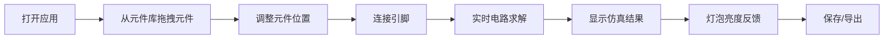

## 1. 产品概述

浏览器端电路图绘制器，面向中学电子课和入门爱好者使用。无需联网，支持从元件库拖拽电池、电阻、开关、灯泡等元件，用导线连接，实时仿真通断和分压计算，灯泡按电流亮度变化，支持保存到本地并导出图片。

- 解决黑板画图不动态、面包板演示后排看不清、学生回家无法复习的痛点
- 降低电子入门学习门槛，提供交互式学习工具

## 2. 核心功能

### 2.1 用户角色
| 角色 | 注册方式 | 核心权限 |
|------|----------|----------|
| 学生/爱好者 | 无需注册，本地使用 | 完整使用所有功能 |

### 2.2 功能模块
1. **主画布页**: 元件库面板、Konva 画布、属性面板、顶部工具栏
2. **电路仿真引擎**: 回路通断检测、节点电压计算、支路电流计算

### 2.3 页面详情
| 页面名称 | 模块名称 | 功能描述 |
|---------|----------|---------|
| 主画布页 | 元件库面板 | 展示电池、电阻、开关、灯泡四类元件，支持拖拽到画布 |
| 主画布页 | Konva 画布 | 元件放置、拖拽移动、引脚连线、缩放平移 |
| 主画布页 | 属性面板 | 显示选中元件参数，支持修改电阻值、电压值等 |
| 主画布页 | 顶部工具栏 | 新建、保存、加载示例、导出图片、清空、撤销重做 |
| 主画布页 | 仿真结果显示 | 实时显示回路通断状态、各节点电压、电流数值 |

## 3. 核心流程

用户从元件库拖拽元件到画布 → 调整元件位置 → 连接引脚形成电路 → 系统实时求解电路 → 显示通断/电压/电流结果 → 灯泡根据电流亮度变化 → 保存到本地或导出图片

## 4. 用户界面设计

### 4.1 设计风格
- **主色调**: 深色工业风格，主色深蓝 (#1e3a5f)，辅色青蓝 (#0ea5e9)
- **按钮风格**: 圆角矩形，带有微妙的阴影和悬停状态
- **字体**: JetBrains Mono 用于数值显示，Space Grotesk 用于标题，Geist 用于正文
- **布局风格**: 三栏布局（左元件库、中画布、右属性面板）
- **画布背景**: 带有网格的深灰色背景，营造电路板质感
- **图标风格**: Lucide 线性图标

### 4.2 页面设计概述
| 页面名称 | 模块名称 | UI 元素 |
|---------|----------|----------|
| 主画布页 | 元件库面板 | 卡片式元件列表，悬停放大效果，拖拽光标 |
| 主画布页 | Konva 画布 | 网格背景、元件图标、连线贝塞尔曲线、引脚高亮 |
| 主画布页 | 属性面板 | 表单式参数编辑，数值实时更新 |
| 主画布页 | 顶部工具栏 | 图标按钮组，带 Tooltip 提示 |
| 主画布页 | 仿真结果 | 电流动画效果，发光灯泡效果 |

### 4.3 响应式
- 桌面端优先，最小宽度 1200px。画布区域自适应居中缩放。

