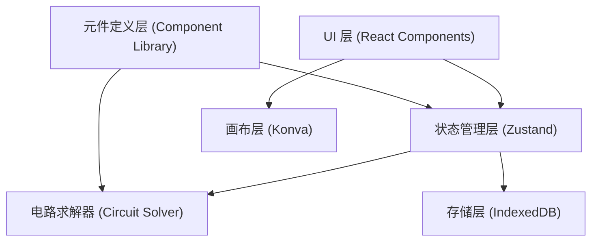
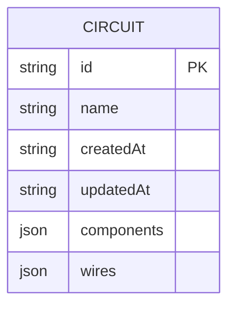

## 1. 架构设计



## 2. 技术选型

- **前端框架**: React 18 + TypeScript
- **构建工具**: Vite
- **状态管理**: Zustand
- **画布库**: Konva (react-konva)
- **样式方案**: TailwindCSS 3
- **图标**: Lucide React
- **本地存储**: IndexedDB (idb)
- **测试框架**: Vitest

## 3. 目录结构

```
src/
├── components/          # UI 组件
│   ├── Canvas/           # Konva 画布相关组件
│   ├── ComponentLibrary/  # 元件库面板
│   ├── PropertyPanel/    # 属性面板
│   └── Toolbar/          # 顶部工具栏
├── solver/            # 电路求解器（独立模块，可单独测试）
├── components-def/      # 元件库定义（独立模块）
├── store/             # Zustand 状态管理
├── db/                # IndexedDB 封装
├── utils/             # 工具函数
├── types/             # 类型定义
├── App.tsx
└── main.tsx
```

## 4. 核心模块职责分离

### 4.1 元件库定义层 (`src/components-def/`)
- 定义电池、电阻、开关、灯泡的引脚定义、默认参数、渲染配置
- 完全独立，不依赖 React 和画布

### 4.2 电路求解器 (`src/solver/`)
- 输入：元件列表 + 连接关系
- 输出：各节点电压、各支路电流、通断状态
- 采用节点电压法 (Modified Nodal Analysis)
- 完全独立，可单独单元测试

### 4.3 画布层 (`src/components/Canvas/`)
- Konva 渲染、拖拽、连线、缩放
- 依赖元件定义层获取渲染信息
- 不直接处理求解逻辑

### 4.4 状态管理层 (`src/store/`)
- 管理元件实例、连接关系、求解结果
- 连接各模块

## 5. 数据模型



## 6. 模块间接口定义

### 6.1 元件数据结构
```typescript
interface CircuitComponent {
  id: string;
  type: 'battery' | 'resistor' | 'switch' | 'bulb';
  x: number;
  y: number;
  rotation: number;
  params: Record<string, number | boolean>;
}

interface Wire {
  id: string;
  from: { componentId: string; pinId: string };
  to: { componentId: string; pinId: string };
}
```

### 6.2 求解器接口
```typescript
interface SolverResult {
  isConnected: boolean;
  nodeVoltages: Record<string, number>;
  branchCurrents: Record<string, number>;
  errors: string[];
}
```
